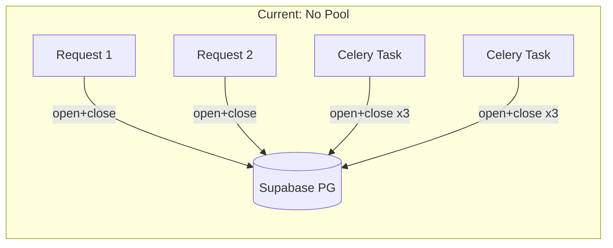
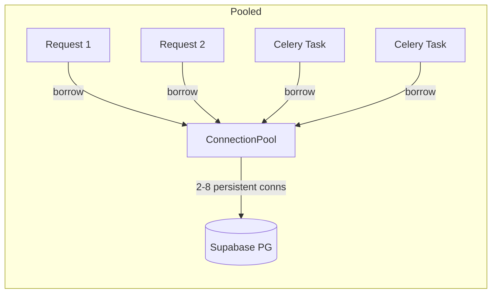

# DB Connection Pooling

## Problem

Every call to `get_connection()` opens a **new TCP connection** to Supabase Postgres (SSL handshake, auth, etc.) and closes it immediately after. There are **59 call sites** across the backend. The worst offender is `process_game` in [tasks.py](backend/tasks.py) which opens **3 sequential connections per game** — during a 500-game import with concurrency=4, that's potentially **6,000 connection open/close cycles**.



## Solution



Use `psycopg_pool.ConnectionPool` — psycopg3's built-in pool — with a single shared pool instance. Connections are borrowed, used, and returned (not opened/closed each time). Supabase also offers a PgBouncer pooler endpoint (port 6543) which you should consider using in your `DATABASE_URL` for even better connection management.

## Changes

### 1. Add `psycopg_pool` dependency

In [backend/requirements.txt](backend/requirements.txt), add `psycopg_pool>=3.1.0` (ships separately from `psycopg`).

### 2. Rewrite `db_connection.py` with a pool

Replace [backend/db_connection.py](backend/db_connection.py):

- Create a module-level `ConnectionPool` instance (lazy-initialized)
- `min_size=2, max_size=8` — keeps 2 warm connections, caps at 8 (well within Supabase limits)
- `get_connection()` becomes a context manager that borrows from the pool and returns on exit
- Keep a backward-compatible `get_connection()` function for the existing `try/finally: conn.close()` pattern — the pool's `.getconn()` returns a connection, and `.putconn()` (or the context manager) returns it

```python
from psycopg_pool import ConnectionPool

_pool: ConnectionPool | None = None

def _get_pool() -> ConnectionPool:
    global _pool
    if _pool is None:
        _pool = ConnectionPool(
            DATABASE_URL,
            min_size=2,
            max_size=8,
            kwargs={
                "autocommit": False,
                "row_factory": dict_row,
                "prepare_threshold": None,
            },
            timeout=10,
        )
    return _pool

def get_connection() -> psycopg.Connection:
    """Borrow a connection from the pool.
    
    Caller MUST call conn.close() when done — the pool intercepts
    close() and returns the connection to the pool instead of
    destroying it.
    """
    return _get_pool().getconn()
```

Key detail: `psycopg_pool` overrides `conn.close()` so that it **returns the connection to the pool** rather than actually closing it. This means **all existing `try/finally: conn.close()` patterns continue to work unchanged** — they'll just return to the pool instead of destroying the connection.

### 3. Update `dependencies.py` — no changes needed

[backend/dependencies.py](backend/dependencies.py) already does `conn = get_connection()` / `finally: conn.close()`, which will automatically work with the pool (close = return to pool).

### 4. Refactor `process_game` to use one connection

[backend/tasks.py](backend/tasks.py) `process_game` (the hottest path — called once per imported game) currently opens 3 connections sequentially. Refactor to borrow one connection and do all 3 operations (upsert, features, scan) in a single connection scope:

```python
@app.task(...)
def process_game(self, game_data, username, site):
    conn = get_connection()
    try:
        inserted, skipped = bulk_upsert_games(conn, [game_data])
        # ... features + scan in same conn ...
        conn.commit()
    except Exception as exc:
        conn.rollback()
        raise self.retry(exc=exc)
    finally:
        conn.close()  # returns to pool
```

This reduces pool pressure from 3 borrows to 1 per game task.

### 5. Leave other call sites as-is (for now)

The remaining `get_connection()` call sites in [tasks.py](backend/tasks.py) (`run_insights`, `run_scan`, `finalize_import`), [insights.py](backend/insights.py), and [quick_scan.py](backend/quick_scan.py) all follow `try/finally: conn.close()`. They'll automatically benefit from pooling without code changes — `conn.close()` just returns to the pool now. Further consolidation of those (reducing borrows per pipeline) can be a follow-up.

### 6. Add pool health check

Add a `check_pool()` helper to [db_connection.py](backend/db_connection.py) and optionally call it from the `/health` endpoint so you can monitor pool stats.

## What NOT to change

- **Concurrency stays at 4** (per your request)
- **No changes to FastAPI routers** — `Depends(get_db)` continues to work identically
- **No changes to `db.py`** — it re-exports `get_connection` from `db_connection`; the new pooled version flows through automatically
