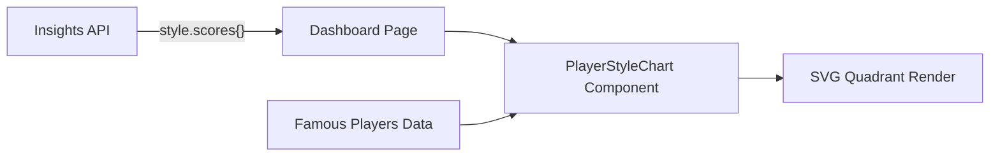

# Player Style Quadrant Chart

## Current State

- Backend already computes four style scores in `[0, 1]`: `tactical`, `positional`, `aggressive`, `solid` via `compute_style_scores` in [`backend/services/insights_aggregate.py`](backend/services/insights_aggregate.py)
- These scores are returned under `features.style.scores` in the insights API response
- The frontend [`InsightsProfile`](frontend/app/dashboard/page.tsx) type currently only reads `features.style.label` (a string) -- it does not consume the numeric scores
- The "Player Type" card (line ~1982 of the dashboard) is text-only: label + description
- No chart library is installed in the frontend

## Architecture



## Plan

### 1. Update frontend type to include style scores

In [`frontend/app/dashboard/page.tsx`](frontend/app/dashboard/page.tsx), expand the `InsightsProfile.features.style` type (line ~91) to include scores:

```typescript
style?: {
  label?: string;
  scores?: {
    tactical?: number;
    positional?: number;
    aggressive?: number;
    solid?: number;
  };
};
```

No backend changes needed -- the API already returns these scores, the frontend just doesn't type them.

### 2. Create the `PlayerStyleChart` component

New file: `frontend/components/PlayerStyleChart.tsx`

A **pure SVG** component (no external chart library) that renders:

- **Four colored quadrants** with subtle background fills matching the app's zen theme (using CSS variables like `--zen-border`, opacity-based fills)
- **Axis labels** at the extremes: "positional" (top), "tactical" (bottom), "solid" (left), "aggressive" (right)
- **Reference dots** for ~10-12 famous chess players (hardcoded positions based on well-known playing styles), each rendered as a small labeled dot
- **User's position** rendered as a larger, highlighted marker that stands out from the reference players

Coordinate mapping:
- **x-axis**: `aggressive_score - solid_score` mapped from [-1, 1] to chart width (left = solid, right = aggressive)
- **y-axis**: `positional_score - tactical_score` mapped from [-1, 1] to chart height (top = positional, bottom = tactical)

Famous players reference data (hardcoded approximate positions):
- Magnus Carlsen (0.3, 0.6) -- aggressive-positional
- Anatoly Karpov (-0.1, 0.7) -- solid-positional
- Mikhail Tal (0.9, -0.7) -- aggressive-tactical
- Garry Kasparov (0.1, -0.6) -- slightly aggressive-tactical
- José Capablanca (0.0, 0.1) -- balanced center
- Viswanathan Anand (0.3, 0.3) -- slightly aggressive-positional
- Hikaru Nakamura (0.4, -0.5) -- aggressive-tactical
- Boris Spassky (-0.3, -0.4) -- solid-tactical
- Judit Polgar (0.4, -0.3) -- aggressive-tactical
- David Bronstein (-0.5, 0.4) -- solid-positional

Props interface:

```typescript
interface PlayerStyleChartProps {
  scores: {
    tactical: number;
    positional: number;
    aggressive: number;
    solid: number;
  };
  username: string;
}
```

### 3. Integrate into the dashboard

Replace the current text-only "Player Type" card (lines ~1982-1992 of [`frontend/app/dashboard/page.tsx`](frontend/app/dashboard/page.tsx)) with:
- The style label and description text (kept above/below)
- The `PlayerStyleChart` component rendered when `features.style.scores` is available
- Graceful fallback to text-only when scores are missing

The chart card will span the full width of the grid (`lg:col-span-2`) since it needs horizontal space for the quadrant visualization.

### 4. Styling

- Use the existing zen theme CSS variables for colors, borders, and text
- Quadrant fills: subtle, low-opacity colors (similar to the image's red/blue/green/yellow but muted to fit the app theme)
- Responsive: the SVG uses `viewBox` so it scales naturally; wrap in a container with `max-w` constraints
- Famous player dots: small, muted; user dot: larger with a glow/ring effect to draw attention
