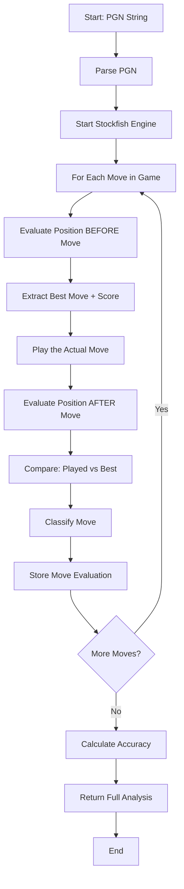
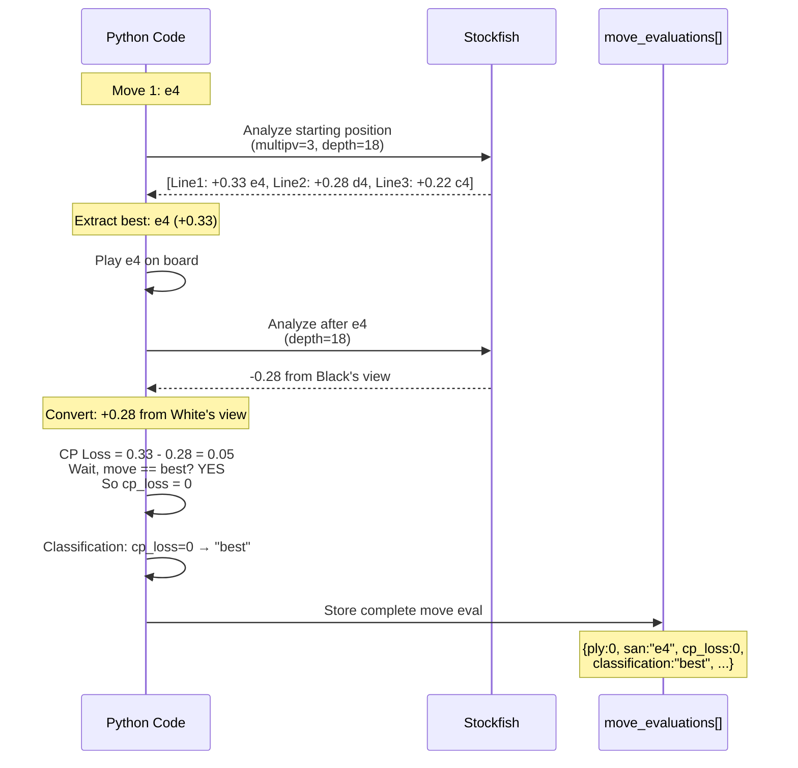

# Full Move-by-Move Analysis Explained

This document explains how `run_full_analysis()` in `backend/full_analysis.py` works, with step-by-step examples and diagrams.

---

## High-Level Flow



---

## Example: Analyzing a Simple Game

Let's walk through analyzing this 3-move game:

```
1. e4 e5
2. Nf3 Nc6
3. Bc4
```

### Input (PGN)

```
[Event "Casual Game"]
[White "Alice"]
[Black "Bob"]
[Result "1-0"]

1. e4 e5 2. Nf3 Nc6 3. Bc4 1-0
```

---

## Step-by-Step Execution

### 1. Parse PGN

```python
game = chess.pgn.read_game(io.StringIO(pgn_string))
board = game.board()
moves_list = list(game.mainline_moves())
```

**Result:**
```python
moves_list = [
    Move.from_uci("e2e4"),  # ply 0
    Move.from_uci("e7e5"),  # ply 1
    Move.from_uci("g1f3"),  # ply 2
    Move.from_uci("b8c6"),  # ply 3
    Move.from_uci("f1c4"),  # ply 4
]
```

---

### 2. Loop: Move 1 White (e4)

#### 2.1 Position BEFORE the move

```python
ply = 0
move = Move.from_uci("e2e4")
fen_before = "rnbqkbnr/pppppppp/8/8/8/8/PPPPPPPP/RNBQKBNR w KQkq - 0 1"
side_to_move = chess.WHITE
```

```
  a b c d e f g h
8 ♜ ♞ ♝ ♛ ♚ ♝ ♞ ♜  8
7 ♟ ♟ ♟ ♟ ♟ ♟ ♟ ♟  7
6 · · · · · · · ·  6
5 · · · · · · · ·  5
4 · · · · · · · ·  4
3 · · · · · · · ·  3
2 ♙ ♙ ♙ ♙ ♙ ♙ ♙ ♙  2
1 ♖ ♘ ♗ ♕ ♔ ♗ ♘ ♖  1
  a b c d e f g h
```

#### 2.2 Analyze BEFORE (ask engine: what's the best move here?)

```python
info_before = engine.analyse(
    current_board,
    chess.engine.Limit(depth=18, time=0.2),
    multipv=3  # Ask for 3 lines
)
```

**When MultiPV = 3, engine returns a list:**

```python
info_before = [
    {
        "score": PovScore(Cp(+33), WHITE),  # +0.33 for White
        "depth": 18,
        "pv": [e2e4, e7e5, g1f3, b8c6, f1b5, ...]  # Best line
    },
    {
        "score": PovScore(Cp(+28), WHITE),  # +0.28 for White
        "depth": 18,
        "pv": [d2d4, d7d5, g1f3, g8f6, ...]  # 2nd best
    },
    {
        "score": PovScore(Cp(+22), WHITE),  # +0.22 for White
        "depth": 18,
        "pv": [c2c4, e7e5, b1c3, g8f6, ...]  # 3rd best
    }
]
```

#### 2.3 Handle MultiPV Results (Lines 167-183)

```python
if isinstance(info_before, list):  # TRUE, because multipv=3
    main_info = info_before[0]  # Take first line (best move)
    multi_pv_data = []
    
    for info in info_before:  # Loop through all 3 lines
        pv_score = info.get("score")  # e.g., Cp(+33)
        pv_moves = info.get("pv", [])  # e.g., [e2e4, e7e5, g1f3, ...]
        
        if pv_score:
            score_dict = score_to_dict(pv_score, side_to_move)
            # Returns: {"cp": 33, "mate": None, "depth": 18}
            
            score_dict["depth"] = info.get("depth", depth)
            
            multi_pv_data.append({
                "cp": 33,
                "mate": None,
                "depth": 18,
                "pv": ["e2e4", "e7e5", "g1f3", "b8c6", "f1b5", ...]  # UCI notation
            })
```

**After the loop:**

```python
main_info = {
    "score": PovScore(Cp(+33), WHITE),
    "depth": 18,
    "pv": [e2e4, e7e5, g1f3, ...]
}

multi_pv_data = [
    {"cp": 33, "mate": None, "depth": 18, "pv": ["e2e4", "e7e5", ...]},  # Line 1
    {"cp": 28, "mate": None, "depth": 18, "pv": ["d2d4", "d7d5", ...]},  # Line 2
    {"cp": 22, "mate": None, "depth": 18, "pv": ["c2c4", "e7e5", ...]},  # Line 3
]
```

---

### 3. Extract Best Move

```python
best_move = main_info.get("pv", [None])[0]  # e2e4 (first move of best line)
best_move_san = current_board.san(best_move)  # "e4"
best_move_uci = best_move.uci()  # "e2e4"

score_before = main_info.get("score")  # PovScore(Cp(+33), WHITE)
eval_before_cp = 33  # Centipawns from White's perspective
```

---

### 4. Play the Actual Move

```python
move_san = current_board.san(move)  # "e4"
move_uci = move.uci()  # "e2e4"

current_board.push(move)  # Apply move to board
fen_after = "rnbqkbnr/pppppppp/8/8/4P3/8/PPPP1PPP/RNBQKBNR b KQkq e3 0 1"
```

```
  a b c d e f g h
8 ♜ ♞ ♝ ♛ ♚ ♝ ♞ ♜  8
7 ♟ ♟ ♟ ♟ ♟ ♟ ♟ ♟  7
6 · · · · · · · ·  6
5 · · · · · · · ·  5
4 · · · · ♙ · · ·  4  ← White played e4
3 · · · · · · · ·  3
2 ♙ ♙ ♙ ♙ · ♙ ♙ ♙  2
1 ♖ ♘ ♗ ♕ ♔ ♗ ♘ ♖  1
  a b c d e f g h
```

---

### 5. Analyze AFTER (what's the eval of this new position?)

```python
info_after = engine.analyse(
    current_board,  # Board AFTER e4
    chess.engine.Limit(depth=18, time=0.2)
)
```

**Returns:**

```python
info_after = {
    "score": PovScore(Cp(+28), BLACK),  # From Black's perspective: -28 for White
    "depth": 18,
    "pv": [e7e5, g1f3, b8c6, ...]
}
```

#### Convert to White's perspective

```python
score_after = info_after.get("score")
eval_after_dict = score_to_dict(score_after, not side_to_move)  # Flip to Black's view
# Result: {"cp": 28, "mate": None, "depth": 18}

eval_after_cp = -score_to_cp(score_after, side_to_move)  # Negate for White's view
# Result: -(-28) = +28 for White
```

---

### 6. Calculate CP Loss (How good was the move?)

```python
# Did White play the best move?
if best_move and move == best_move:  # e4 == e4? YES
    cp_loss = 0  # Perfect move!
```

**Classification:**

```python
classification = classify_move(cp_loss)
# cp_loss = 0 → "best"
```

---

### 7. Store Move Evaluation

```python
move_eval = {
    "ply": 0,
    "san": "e4",
    "uci": "e2e4",
    "fen_before": "rnbqkbnr/pppppppp/8/8/8/8/PPPPPPPP/RNBQKBNR w KQkq - 0 1",
    "fen_after": "rnbqkbnr/pppppppp/8/8/4P3/8/PPPP1PPP/RNBQKBNR b KQkq e3 0 1",
    "eval_before": {"cp": 33, "mate": None, "depth": 18},
    "eval_after": {"cp": 28, "mate": None, "depth": 18},
    "best_move_uci": "e2e4",
    "best_move_san": "e4",
    "pv": ["e2e4", "e7e5", "g1f3", "b8c6", "f1b5", ...],
    "classification": "best",
    "cp_loss": 0,
    "multi_pv": [
        {"cp": 33, "mate": None, "depth": 18, "pv": ["e2e4", "e7e5", ...]},
        {"cp": 28, "mate": None, "depth": 18, "pv": ["d2d4", "d7d5", ...]},
        {"cp": 22, "mate": None, "depth": 18, "pv": ["c2c4", "e7e5", ...]},
    ]
}

move_evaluations.append(move_eval)
```

---

### 8. Track for Accuracy

```python
if cp_loss is not None:
    if side_to_move == chess.WHITE:
        white_cp_losses.append(0)  # White lost 0 cp (perfect)
```

---

## Example 2: A Bad Move

Let's say on move 2, White plays **Nf3** when **Bc4** was better.

### Before Nf3

```
Position: 1. e4 e5 (Black just played e5)
FEN: rnbqkbnr/pppp1ppp/8/4p3/4P3/8/PPPP1PPP/RNBQKBNR w KQkq e6 0 2
```

### Engine Analysis

```python
info_before = [
    {
        "score": PovScore(Cp(+42), WHITE),  # Bc4 is +0.42
        "pv": [f1c4, g8f6, d2d3, ...]
    },
    {
        "score": PovScore(Cp(+35), WHITE),  # Nf3 is +0.35
        "pv": [g1f3, b8c6, f1b5, ...]
    },
]

best_move = f1c4  # Bc4 is best
eval_before_cp = 42  # +0.42 for White
```

### White Plays Nf3 (not the best)

```python
move = g1f3
eval_after_cp = 35  # Position after Nf3 is +0.35 for White
```

### Calculate Loss

```python
cp_loss = eval_before_cp - eval_after_cp
cp_loss = 42 - 35 = 7  # Lost 7 centipawns

classification = classify_move(7)
# 7 < 10 → "excellent" (very close to best)
```

---

## Data Transformation Diagram

```mermaid
flowchart LR
    subgraph Input
        PGN["PGN String<br/>1. e4 e5 2. Nf3"]
    end
    
    subgraph Parsing
        Moves["moves_list<br/>[e2e4, e7e5, g1f3]"]
    end
    
    subgraph PerMove[Per-Move Loop]
        Before["Position BEFORE<br/>FEN + Board State"]
        Engine1["Engine Analyze<br/>depth=18, multipv=3"]
        BestMove["Best Move<br/>+ Eval Before"]
        Played["Play Actual Move"]
        Engine2["Engine Analyze<br/>depth=18"]
        EvalAfter["Eval After"]
        Loss["CP Loss<br/>= before - after"]
        Class["Classification<br/>best/inaccuracy/etc"]
    end
    
    subgraph Output
        MoveEval["MoveEvaluation Object<br/>{ply, san, eval, classification}"]
    end
    
    PGN --> Moves
    Moves --> Before
    Before --> Engine1
    Engine1 --> BestMove
    BestMove --> Played
    Played --> Engine2
    Engine2 --> EvalAfter
    EvalAfter --> Loss
    Loss --> Class
    Class --> MoveEval
```



---

## Detailed Code Walkthrough

### Line-by-line for Move #1 (White plays e4)

```python
# LINE 149-152: Loop starts
for ply, move in enumerate(moves_list):  # ply=0, move=e2e4
    fen_before = current_board.fen()  # Starting position
    side_to_move = current_board.turn  # WHITE (True)
```

**State:**
- `ply` = 0 (first half-move)
- `move` = Move object for e2→e4
- `fen_before` = "rnbqkbnr/pppppppp/8/8/8/8/PPPPPPPP/RNBQKBNR w KQkq - 0 1"
- `side_to_move` = WHITE

---

```python
# LINE 158-162: Ask engine to analyze this position
try:
    info_before = engine.analyse(
        current_board,  # Starting position
        chess.engine.Limit(depth=18, time=0.2),
        multipv=3  # Give me 3 best moves
    )
except Exception:
    info_before = None
```

**What engine returns (simplified):**

```python
info_before = [
    {"score": Cp(+33), "depth": 18, "pv": [e2e4, e7e5, g1f3, ...]},  # Best
    {"score": Cp(+28), "depth": 18, "pv": [d2d4, d7d5, ...]},        # 2nd
    {"score": Cp(+22), "depth": 18, "pv": [c2c4, e7e5, ...]},        # 3rd
]
```

---

```python
# LINE 167-168: Handle list return
if isinstance(info_before, list):  # TRUE (multipv=3 returns list)
    main_info = info_before[0]  # Take the BEST line
    multi_pv_data = []
```

**State:**
- `main_info` = `{"score": Cp(+33), "depth": 18, "pv": [e2e4, e7e5, ...]}`
- `multi_pv_data` = `[]` (will fill this)

---

```python
# LINE 170-180: Process each line for UI display
for info in info_before:  # Loop 3 times
    pv_score = info.get("score")  # e.g., Cp(+33)
    pv_moves = info.get("pv", [])  # e.g., [e2e4, e7e5, ...]
    
    if pv_score:
        score_dict = score_to_dict(pv_score, side_to_move)
        # Converts: Cp(+33) → {"cp": 33, "mate": None, "depth": 18}
        
        score_dict["depth"] = info.get("depth", depth)
        
        multi_pv_data.append({
            **score_dict,  # cp, mate, depth
            "pv": [m.uci() for m in pv_moves[:8]]  # First 8 moves as strings
        })
```

**After loop, `multi_pv_data`:**

```python
[
    {"cp": 33, "mate": None, "depth": 18, "pv": ["e2e4", "e7e5", "g1f3", ...]},
    {"cp": 28, "mate": None, "depth": 18, "pv": ["d2d4", "d7d5", "g1f3", ...]},
    {"cp": 22, "mate": None, "depth": 18, "pv": ["c2c4", "e7e5", "b1c3", ...]},
]
```

These are the **3 lines** the UI will show in the "Engine Analysis" panel.

---

```python
# LINE 183-190: Extract best move and eval
best_move = main_info.get("pv", [None])[0]  # e2e4 (Move object)
pv_moves = main_info.get("pv", [])  # [e2e4, e7e5, g1f3, ...]
score_before = main_info.get("score")  # Cp(+33)

if score_before:
    eval_before_dict = score_to_dict(score_before, side_to_move)
    # {"cp": 33, "mate": None, "depth": 18}
    
    eval_before_cp = score_to_cp(score_before, side_to_move)
    # 33 (just the centipawn number)
```

**State:**
- `best_move` = e2e4 (engine's recommendation)
- `eval_before_cp` = 33 (position is +0.33 for White)

---

```python
# LINE 195-200: Get move notation and apply it
move_san = current_board.san(move)  # "e4"
move_uci = move.uci()  # "e2e4"

current_board.push(move)  # Board now has e4 played
fen_after = "rnbqkbnr/pppppppp/8/8/4P3/8/PPPP1PPP/RNBQKBNR b KQkq e3 0 1"
```

---

```python
# LINE 207-213: Analyze AFTER the move
try:
    info_after = engine.analyse(
        current_board,  # Board with e4 played
        chess.engine.Limit(depth=18, time=0.2)
    )
except Exception:
    info_after = None
```

**Engine returns (single line this time, no multipv):**

```python
info_after = {
    "score": PovScore(Cp(-28), BLACK),  # From Black's perspective
    "depth": 18,
    "pv": [e7e5, g1f3, b8c6, ...]
}
```

**Why negative?** Engine always gives score from the side-to-move's perspective. After e4, it's Black's turn, so:
- Black sees the position as -0.28 (they're slightly worse)
- Which means White is +0.28

---

```python
# LINE 220-228: Convert eval_after to White's perspective
score_after = info_after.get("score")  # Cp(-28) from Black's view

eval_after_dict = score_to_dict(score_after, not side_to_move)
# Convert from Black's perspective
# {"cp": -28, "mate": None, "depth": 18}

eval_after_cp = -score_to_cp(score_after, side_to_move)
# Negate to get White's perspective: -(-28) = +28
```

**State:**
- `eval_after_cp` = 28 (position after e4 is +0.28 for White)

---

```python
# LINE 233-243: Calculate centipawn loss
if best_move and move == best_move:  # e4 == e4? YES
    cp_loss = 0  # Perfect move!
elif eval_before_dict and eval_after_dict:
    cp_loss = eval_before_cp - eval_after_cp
    # 33 - 28 = 5 centipawns lost
    cp_loss = max(0, cp_loss)
else:
    cp_loss = None
```

**For this move:**
- Played e4 = Best move → **cp_loss = 0**

---

```python
# LINE 245: Classify the move
classification = classify_move(cp_loss)
# cp_loss = 0 → "best"
```

**Classification thresholds:**
- 0 → best
- 1-9 → excellent
- 10-29 → good
- 30-99 → inaccuracy
- 100-299 → mistake
- 300+ → blunder

---

```python
# LINE 248-252: Track for accuracy calculation
if cp_loss is not None:
    if side_to_move == chess.WHITE:
        white_cp_losses.append(cp_loss)  # [0]
    else:
        black_cp_losses.append(cp_loss)
```

---

```python
# LINE 255-273: Build the complete move evaluation object
move_eval = {
    "ply": 0,
    "san": "e4",
    "uci": "e2e4",
    "fen_before": "rnbqkbnr/pppppppp/8/8/8/8/PPPPPPPP/RNBQKBNR w KQkq - 0 1",
    "fen_after": "rnbqkbnr/pppppppp/8/8/4P3/8/PPPP1PPP/RNBQKBNR b KQkq e3 0 1",
    "eval_before": {"cp": 33, "mate": None, "depth": 18},
    "eval_after": {"cp": 28, "mate": None, "depth": 18},
    "best_move_uci": "e2e4",
    "best_move_san": "e4",
    "pv": ["e2e4", "e7e5", "g1f3", "b8c6", "f1b5", ...],
    "classification": "best",
    "cp_loss": 0,
    "multi_pv": [
        {"cp": 33, "mate": None, "depth": 18, "pv": ["e2e4", ...]},
        {"cp": 28, "mate": None, "depth": 18, "pv": ["d2d4", ...]},
        {"cp": 22, "mate": None, "depth": 18, "pv": ["c2c4", ...]},
    ]
}

move_evaluations.append(move_eval)
```

**This object has everything the UI needs:**
- Position before/after
- Evaluation before/after
- Best move suggestion
- How good the move was (classification)
- Alternative lines (multi_pv)

---

## After All Moves: Calculate Accuracy

```python
# LINE 277-286: Accuracy formula
def calc_accuracy(losses: list[int]) -> int:
    if not losses:
        return 100
    
    clamped = [min(loss, 600) for loss in losses]  # Cap at 600
    avg_loss = sum(clamped) / len(clamped)
    accuracy = 100 * math.exp(-avg_loss / 250)  # Exponential decay
    return round(max(0, min(100, accuracy)))

accuracy_white = calc_accuracy([0, 7, 0, 15, 3, ...])  # All White's cp_losses
accuracy_black = calc_accuracy([5, 0, 12, 95, ...])    # All Black's cp_losses
```

**Example:**
- If White's average loss is 15 cp → accuracy ≈ 94%
- If White's average loss is 50 cp → accuracy ≈ 82%
- If White's average loss is 150 cp → accuracy ≈ 55%

---

## Final Return Value

```python
return {
    "moves": [
        # Move 1: White e4
        {"ply": 0, "san": "e4", "classification": "best", "cp_loss": 0, ...},
        # Move 1: Black e5
        {"ply": 1, "san": "e5", "classification": "excellent", "cp_loss": 5, ...},
        # Move 2: White Nf3
        {"ply": 2, "san": "Nf3", "classification": "excellent", "cp_loss": 7, ...},
        # ... all other moves
    ],
    "summary": {
        "accuracy_white": 96,
        "accuracy_black": 89,
        "opening_name": "Italian Game",
        "opening_eval": {"cp": 28, "mate": None, "depth": 18},
        "total_moves": 5,
        "white_player": "Alice",
        "black_player": "Bob",
    },
    "meta": {
        "engine": "stockfish",
        "depth": 18,
        "multipv": 3,
        "time_per_position_ms": 200,
        "total_time_ms": 8500,
        "positions_analyzed": 10,  # 5 moves × 2 (before + after)
    }
}
```

---

## Visual Data Flow



---

## Key Concepts

### 1. Why Analyze BEFORE and AFTER?

- **BEFORE:** To know what the **best move** was
- **AFTER:** To know the **resulting evaluation** after the player's choice
- **Difference:** Tells us how much the move **cost** in evaluation

### 2. Why MultiPV?

So the UI can show alternative moves:

```
Engine Analysis (Depth 18)
1. +0.33  e4 e5 Nf3 Nc6 Bb5     ← Best
2. +0.28  d4 d5 c4 e6 Nc3       ← Also good
3. +0.22  c4 e5 Nc3 Nf6         ← Third option
```

### 3. Perspective Handling

Stockfish always evaluates from the **side-to-move's** perspective:
- Position before White's move → eval from White's view
- Position after White's move (Black to move) → eval from Black's view

So we flip the sign when needed to keep everything from one player's perspective.

---

## Example Output for UI

When the frontend receives this data, it builds:

1. **Move List:** 
   ```
   1. e4!! e5!  2. Nf3! Nc6  3. Bc4
   ```

2. **Engine Panel (at position after move 1):**
   ```
   1. +0.33  e4 e5 Nf3 Nc6 Bb5
   2. +0.28  d4 d5 c4 e6 Nc3
   3. +0.22  c4 e5 Nc3 Nf6
   ```

3. **Accuracy Badge:**
   ```
   White: 96%
   Black: 89%
   ```

4. **Current Move Panel:**
   ```
   e4
   Classification: Best
   CP Loss: 0
   ```

---

## Performance

For a 40-move game (80 plies):
- Positions analyzed: 80 × 2 = **160 positions**
- Time per position: ~200ms at depth 18
- Total time: 160 × 0.2s = **32 seconds**

This is why the UI says "~20-40 seconds" when you click "Run Full Analysis".

---

## Summary

The `run_full_analysis()` function:

1. **Parses** the PGN into a list of moves
2. For **each move**:
   - Asks Stockfish: "What's best here?" (BEFORE)
   - Plays the actual move
   - Asks Stockfish: "How good is this position now?" (AFTER)
   - Calculates how much eval changed (cp_loss)
   - Classifies the move (best/excellent/.../blunder)
3. **Calculates accuracy** for both players based on average cp_loss
4. **Returns** a complete analysis object with evaluations for every move

The key insight: by analyzing **before each move**, we know what the player **should** have played, so we can judge how good their actual move was.
